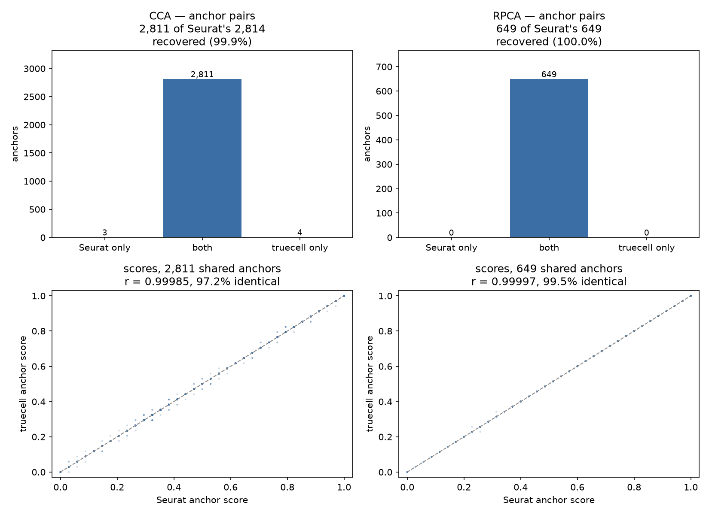

# Anchor internals — the v4 and v5 anchor paths vs Seurat

**Dataset** — ifnb (Kang et al. 2018); v4 section: a fixed 2,400-cell subsample
(CTRL 1,200 / STIM 1,200); v5 section: the full 13,999 cells (CTRL 6,548 /
STIM 7,451) · 2,000 shared anchor features throughout
**R side** — Seurat 5.5.1 · `tutorials/anchors_verify.R` (v4, `nn.method = "rann"`,
exact neighbours) · `tutorials/ifnb_integration_verify.R` (v5)
**Python side** — `tutorials/anchors_tutorial.py` (v4) ·
`tutorials/ifnb_integration_tutorial.py` (v5)

---

## Why a second integration tutorial

The [integration vignette](integration_vignette.md) compares **clusterings**: it
asks whether the two tools recover the same structure once the batch effect is
gone. That is the right end-to-end question, and it is also lossy. A partition
can agree while the anchors underneath it do not — cluster labels survive a
great deal of damage before an adjusted Rand index notices.

This tutorial compares the anchors themselves: which mutual-nearest-neighbour
**pairs** each tool calls an anchor, what **score** it gives them, and what the
**corrected expression** of the query half comes out as.

Asking that question found twelve defects in the v4 path below, and — treating
what looked like the residual "implementation gap" on v5's `IntegrateLayers`
as a claim to check rather than a place to stop —
[two more](#v5-integratelayers-runs-a-different-algorithm-than-v4-integratedata).

---

## Result



| | Seurat | truecell | shared | recall | precision | score *r* | identical |
|---|---|---|---|---|---|---|---|
| **CCA** | 2,814 | 2,815 | 2,811 | **99.9 %** | 99.9 % | 0.99985 | 97.2 % |
| **RPCA** | 649 | 649 | 649 | **100.0 %** | 100.0 % | 0.99997 | 99.5 % |

RPCA agrees on **every anchor**, and on 99.5 % of them the score is identical to
the last bit. Before this work CCA recovered **70.0 %** of Seurat's anchors at
60.3 % precision.


| correction over the query half | truecell | Seurat |
|---|---|---|
| CCA mean \|Δ\| | 0.099286 | 0.099201 |
| CCA fraction of entries moved | 0.6461 | 0.6460 |
| RPCA mean \|Δ\| | 0.087997 | 0.088026 |
| RPCA fraction of entries moved | 0.6937 | 0.6942 |

---

## Reading Seurat rather than guessing it

Two of these functions are compiled, so their behaviour was pinned by calling
them directly with controlled inputs rather than inferred from the R wrappers:

```
FindWeightsC   w = 1 − exp(−d̃ · score / (2/sd)²)      where d̃ = 1 − d/dₖ
IntegrateDataC corrected = query − Wᵀ (query − ref)
```

Both reproduce to `max|diff| = 0` on random input. The kernel matters: it *rises*
with proximity and folds the anchor score **into the exponent**. A Gaussian in
the raw distance multiplied by the score — which is what truecell had — is a
different curve with a different ranking, and it even responds to its bandwidth
in the opposite direction.

---

## The twelve

### `find_integration_anchors`

1. **`RunCCA` standardizes each cell; truecell L2-normalized it.** The dominant
   one. A cross-covariance of standardized matrices is a *correlation* matrix
   between cells; of L2-normalized ones, *cosine similarity*. Different singular
   vectors, so every anchor moves. Recall alone: 70.0 % → 86.5 %.
2. **`CheckFeatures` was missing.** `RunCCA` silently drops anchor features that
   are constant in either object — 83 of 2,000 here. Standardizing works down
   each *cell*, so a constant gene still shifts that cell's mean and SD and
   therefore every standardized value.
3. **The filter ran on the wrong genes.** `FilterAnchors` uses
   `TopDimFeatures` — at most 200 genes picked from the CCA loadings (193 here),
   not the full 2,000-gene anchor set.
4. **The filter ran on the wrong layer.** Seurat's `slot = "data"`, the
   log-normalized values; truecell used `scale.data`.
5. **The score used one pooled kNN.** `ScoreAnchors` gives each anchor member
   `k.score` neighbours *within its own dataset* **plus** `k.score` in the
   other — 2·k.score cells from four separate searches. With a batch effect
   present a pooled neighbourhood is nearly all same-batch, so the two members
   share almost nothing and every score collapses toward the floor.
6. **`k.filter` shrank instead of standing down.** Seurat keeps every anchor
   when `min(len(cells1), len(cells2)) < k.filter`. Clamping k to the query size
   quietly applies a stricter filter than asked for, on the datasets least able
   to afford it.
7. **Filtering and scoring were the wrong way round.** `FindAnchors` filters
   *then* scores, and the score is rescaled against the 1st/90th percentiles of
   whatever set it is handed. Scoring first takes those percentiles from anchors
   that are about to be discarded: same ranking, every value shifted. This one
   surfaced only during the port — mean score 0.5477 against Seurat's 0.4971,
   with just 10.5 % identical.
8. **`_pca_loadings` used sklearn's randomized SVD.** For a matrix this shape
   sklearn switches to a randomized solver, which is accurate in the leading
   components and drifts in the trailing ones — only 12–14 of 30 PCs matched
   irlba above 0.99. Ordinarily that is harmless. Reciprocal PCA standardizes
   each projected dimension by its own SD, and **that is not rotation
   invariant**, so a drifted trailing axis becomes a different reciprocal space
   and a different anchor. Exact SVD matches irlba to 1.0000 on all 30 PCs and
   takes RPCA recall from **44.9 % to 100 %**.

### `integrate_data`

9. **The weights were computed in the wrong space.** `RunIntegration` merges the
   pair, re-runs `ScaleData` on the anchor features and runs a **fresh PCA**,
   then searches there. truecell reused the CCA embedding — a space built to make
   the batches overlap, which is not the same neighbourhood.
10. **The kernel** (above).
11. **`k_weight` counts anchors, not anchor cells.** `FindWeightsC` walks the
    nearest anchor *cells* outward, expands each into all of its anchor rows and
    stops at `k_weight` **entries**. At ~2.7 anchors per cell only the nearest
    ~37 cells contribute, not 100. The neighbour search also runs over the
    **unique** query anchor cells: a cell anchoring five times is one candidate.
12. **`integrate_layers` corrected the wrong direction.** Seurat's
    `PairwiseIntegrateReference` reverses the merge pair whenever the second
    object is bigger, so the reference is the **larger** batch. truecell took the
    first. Invisible on an even split; ifnb is CTRL 6,548 vs STIM 7,451.

---

## What this did to the integration tutorial

Full ifnb, through `integrate_layers`, against Seurat's v5 `IntegrateLayers`:

| | before | after | Seurat |
|---|---|---|---|
| CCA — cell-type recovery | 0.884 | **0.918** | 0.927 |
| CCA — batch mixing | 0.990 | 0.991 | 0.991 |
| RPCA — cell-type recovery | 0.677 | **0.922** | 0.736 |
| RPCA — batch mixing | 0.867 | **0.991** | 0.917 |

Reference mapping (`panc8`, which shares these helpers) improved without being
targeted: accuracy 0.9845 → **0.9862**, label concordance 0.9871 → **0.9883**.

RPCA's numbers moved twice more after this table was first written — see
[the v5 `IntegrateLayers` section](#v5-integratelayers-runs-a-different-algorithm-than-v4-integratedata)
below, which is where the "still open" gap noted at the bottom of this page
turned out to live.

---

## A number that got worse before it got better

Fixing the weight kernel **dropped** RPCA's batch-mixing score from 0.867 to
0.689 — worse than the code it replaced.

That was the correct kernel exposing a defect it had been masking. The old
Gaussian was broad and undiscriminating, so it smeared the batches together
regardless of whether the anchors were any good — and batch-mixing entropy
rewards exactly that. Underneath, RPCA was recovering **44.9 %** of Seurat's
anchors. With the kernel honest, the bad anchors had nowhere to hide.

The temptation to restore the old kernel and keep 0.867 is the thing to resist:
it would have meant reinstating a bug to flatter a metric. Chasing the anchors
instead led to defect 8, and RPCA now agrees with Seurat on every single one.

**A metric that improves when you break something is measuring the wrong thing.**
This is the second time in this port — the sketching cycle had a broken
`project_data` that scored better than its fix.

---

## Two dead ends worth recording

**A candidate R-side defect that wasn't.** Probing `FindWeightsC` synthetically,
whole anchor rows came back zero — which looked like an off-by-one in the
compiled code. On a real run the 29 zero rows are exactly the 29 score-0
anchors. The probe had been calling the function outside the domain its only
caller uses.

**A fix that fixed nothing.** Seurat runs each object's PCA on that object's own
non-constant features (1,966 / 1,951) and projects across on their 1,917-feature
intersection. Reproducing that exactly left the anchor set **byte-identical**, so
it was reverted rather than shipped as unverifiable complexity. The cause was
the SVD solver, one layer down.

---

## v5 `IntegrateLayers` runs a different algorithm than v4 `IntegrateData`

Everything above is the v4 path: `FindIntegrationAnchors` + `IntegrateData`,
called directly on a list of objects. Seurat also ships a v5 dispatch API,
`IntegrateLayers(method = CCAIntegration)`, and truecell's `integrate_layers`
wraps it. They are not the same algorithm wearing a different name.

Reading `RPCAIntegration`'s source rather than assuming it delegates to
`IntegrateData` turned up the actual call chain: it finds anchors the same
way, then hands them to **`IntegrateEmbeddings`**, which transposes the input
PCA embedding into a fake assay whose "features" are the 30 dimensions and
runs the *same* anchor-weighting machinery over *that* — correcting the
embedding directly. `IntegrateData` corrects expression and leaves you to
`ScaleData` + `RunPCA` again, landing in a new basis. truecell's `integrate_layers`
was doing the latter behind the v5 name: a different object with the same
shape, agreeing with Seurat's actual output on only **1 of 30 dimensions**
above \|r\| = 0.99.

Alongside it, a second defect that had been hiding in the "expected
implementation gap": `run_pca`'s `_pca_loadings` helper already needed an
exact SVD for reciprocal PCA's own trailing-PC sensitivity (defect 8, above);
the *public* `run_pca` still used sklearn's randomized solver, which drifts
the same way once `max(shape) > 500` — only 15 of 30 PCs matched Seurat's
irlba above \|r\| = 0.99, one down at 0.006. Invisible when only the leading
PCs are read downstream; not invisible when `IntegrateEmbeddings` corrects the
embedding itself. Fixed with the same ARPACK solver `_pca_loadings` uses —
deterministic, and six times faster than a dense SVD on data this shape.

| | before | after |
|---|---|---|
| RPCA embedding, dims \|r\| > 0.99 (2,400-cell probe) | 1/30 | **30/30** |
| CCA embedding, dims \|r\| > 0.99 (2,400-cell probe) | 1/30 | **30/30** |
| RPCA embedding, dims \|r\| > 0.99 (full 13,999-cell, unequal batches) | — | **30/30** |
| RPCA batch mixing (full ifnb) | 0.867 | **0.991** (Seurat: 0.917) |
| RPCA cell-type recovery (full ifnb) | 0.677 | **0.922** (Seurat: 0.736) |

Both clustering rows were measured while `find_clusters` ran igraph's single
Louvain pass. With Seurat's own optimiser they read 0.9165 and 0.7300, beside
Seurat's 0.9171 and 0.7364.

Reference-half cells — the ones `IntegrateEmbeddings` copies through
untouched — now match Seurat at **exactly** zero difference, not just close;
that is the sharpest single check available, since any route that recomputes
rather than copies will show noise there.

**What was left was not integration, it was clustering.** RPCA's partition
agreement with R (`ARI(py,R)`) stayed at 0.774 with the embedding matching to
30/30 dims, and clustering **Seurat's own** RPCA embedding through truecell gave
truecell's numbers, not Seurat's. `find_clusters` now runs Seurat's optimiser,
and `ARI(py,R)` is 0.942: see
[the clustering section of the integration vignette](integration_vignette.md#the-clustering-divergence-and-why-it-was-closed).

---

## Reproducing

```bash
Rscript tutorials/export_seuratdata.R ifnb     # one-time counts export
python  tutorials/anchors_tutorial.py          # writes the cell list + HVGs
Rscript tutorials/anchors_verify.R             # writes the Seurat anchors
python  tutorials/anchors_tutorial.py --report
python  tutorials/generate_anchors_plots.py
```

The v5 section above is exercised by the [integration tutorial](integration_vignette.md)
(`tutorials/ifnb_integration_tutorial.py`, `tutorials/ifnb_integration_verify.R`)
rather than by `anchors_tutorial.py`, which only calls the v4 API.

The Python side writes the subsample and the anchor features; R reads both, so
the two tools integrate the same cells on the same basis and the only
differences left are the algorithms.

`nn.method = "rann"` gives Seurat exact neighbours. Its default is annoy, which
is approximate — re-running identical data with annoy moves about 0.3 % of the
anchors, and that noise would be indistinguishable from a real disagreement.

---

## What is still open

The 14 fixes across both rounds are pinned by `tests/test_anchors_seurat_parity.py`
and `tests/test_pca_solver_parity.py`, and each was **mutation-tested**: break
the fix, confirm a named test fails. Four guards were decorative on the first
pass and had to be rebuilt — the fixtures were not in the regime where the
defect exists (a 120-cell batch never trips `k_filter=200`; a 300×220 matrix
never trips sklearn's randomized solver, which needs `max(shape) > 500`; the
`stdev` formula guard needed *un*-centred scale.data, because the two
candidate formulas agree exactly once every gene's mean is zero).

Not addressed here:

- **The guide tree.** truecell integrates reference-to-query; Seurat builds a
  `BuildSampleTree` merge order for three or more datasets. Two-dataset
  integration is unaffected.

Seurat's modularity search was on this list until the Frontiers revision. The
graphs agreed, and the difference was that Seurat runs 10 restarts of its own
optimiser where truecell ran one igraph pass. truecell's shallower optimum
scored better against ifnb's annotations, so the search was left alone. It has
since been ported, which closed `ARI(py,R)`: see
[the integration vignette](integration_vignette.md#the-clustering-divergence-and-why-it-was-closed).
