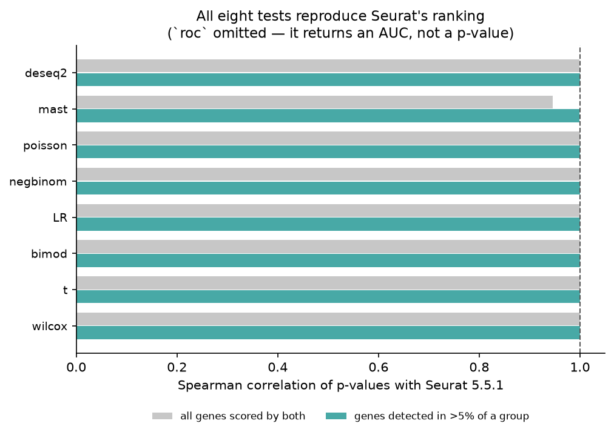
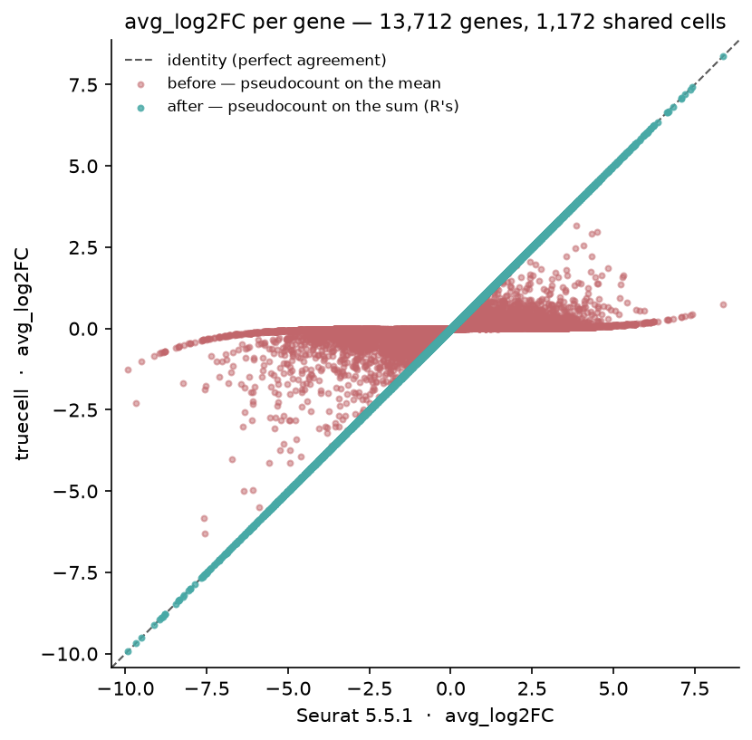
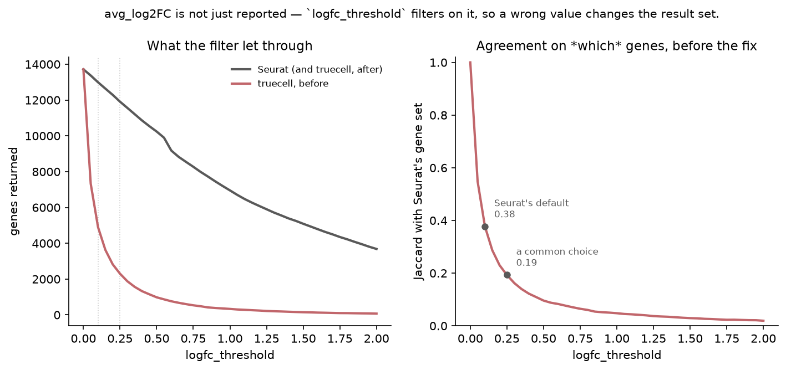

# The Differential-Expression Test Suite — R Seurat vs Truecell (Python)

Wave 3's first side-by-side, and the last large untested surface in the library:
`find_markers` offers **eight statistical tests and none of them had ever been
compared to R**. Their unit tests assert self-consistency on synthetic fixtures —
the same shape of coverage that let the CLR and SCTransform defects survive.

> **Dataset:** pbmc3k — 2,700 PBMCs, 10x Genomics (2016). The comparison runs on
> **clusters 0 and 1** (703 and 480 cells, 13,714 genes).
> **R reference:** Seurat 5.5.1 · MAST 1.38.0 · DESeq2 1.52.0 · **Python:** Truecell

| Seurat | Truecell |
|---|---|
| `FindMarkers(obj, test.use = "wilcox")` | `find_markers(obj, test_use="wilcox")` |
| `test.use = "t"` · `"bimod"` · `"LR"` | `test_use="t"` · `"bimod"` · `"LR"` |
| `test.use = "negbinom"` · `"poisson"` · `"roc"` | `test_use="negbinom"` · `"poisson"` · `"roc"` |
| `test.use = "MAST"` | `test_use="mast"` |
| `test.use = "DESeq2"` | `test_use="deseq2"` |

> **This tutorial found and fixed two defects.** `avg_log2FC` put Seurat's
> pseudocount on the group *mean* rather than the group *sum*, which floored
> every fold change and — because `logfc_threshold` filters on that value —
> changed which genes were returned at all. And `negbinom` ran a
> moment-dispersion likelihood-ratio test where Seurat runs an ML-dispersion
> Wald test. Both are written up in
> [what this tutorial found](#what-this-tutorial-found).

Both tools test the **same cells**: Python clusters pbmc3k and writes the
assignment to `figures_de/groups.csv`, which the R side reads. Both run Seurat's
modularity optimiser, but each builds its own neighbour graph, and a clustering
difference would look exactly like a DE difference.

---

## Headline

| Metric | Result |
|---|---|
| **`avg_log2FC` vs Seurat**, all 13,714 shared genes | **max abs diff 6.22e-15** |
| **Tests reproducing Seurat's top 50 genes** | **8 of 8** p-value tests (`roc` scores AUC, not p) |
| `wilcox` · `t` · `bimod` · `LR` — p-value Spearman | **1.000000** · 0.999977 · 0.999996 · 0.999981 |
| `mast` — Spearman (all genes / detected >5%) | 0.9464 / **0.9993** |
| `negbinom` — Spearman (all genes / detected >5%) | 0.9996 / **0.9999994** |
| `poisson` — Spearman (all genes / detected >5%) | 0.9996 / **0.9999989** |
| `deseq2` — Spearman (all genes / detected >5%) | 0.9993 / **0.9999991**, and the same 712 genes at `p_val_adj < 0.05` |
| `roc` — max abs AUC difference | 5.0e-04, which is Seurat's own 3-dp rounding |
| *Before the fix* — genes returned at `logfc_threshold=0.25` | truecell **2,299** vs Seurat **11,907** (Jaccard 0.193) |

> These numbers are on the two clusters Seurat's optimiser finds, 703 and 480
> cells. Where a section below traces how a defect was found, its numbers are
> from that day, on the earlier partition of 692 and 515 cells, and it says so.

---

## Added later: `poisson`

The ninth test, added after the four waves closed. `poisson` is the other branch
of Seurat's `GLMDETest` — `glm(family = "poisson")` on the counts layer, Wald
p-value off the group coefficient — and it ports cleanly: **50/50** on the top
50, `avg_log2FC` to **6.2e-15**, Spearman **0.9999989** on genes detected above
5 %, and not one gene on which the two tools disagree about `p_val_adj < 0.05`.

**The residual is Seurat's, which has now happened three times in this port.**
truecell's p-values agree to about six significant figures rather than bit-for-bit,
and the gap *grows* with significance — median |Δlog10 p| 1.7e-6 below
`-log10 p = 2`, and 9.8e-5 above 150. That is tail amplification, not a
different statistic: at z ≈ 37 a shift of 0.005 in z moves p by 20 %.

Traced on GPX1, the worst gene on the earlier partition:

| | iterations | z | p |
|---|---|---|---|
| R, default `glm.control(epsilon = 1e-8)` | 5 | 37.002168 | 1.0568e-299 |
| R, `epsilon = 1e-14` | 6 | 36.997126 | **1.27368e-299** |
| truecell (statsmodels IRLS, already converged) | — | 36.997125 | **1.27372e-299** |

truecell matches R's *converged* coefficient to 14 significant figures; R's
default tolerance stops an iteration short. Re-running the top 200 genes at both
tolerances closes 9/10 of the median gap (5.9e-5 → 6.6e-6) and 57/58 of the
worst case (8.1e-2 → 1.4e-3). truecell is the more converged of the two, so
nothing was "fixed" to chase it — the same call as the Visium tutorial's
radius-in-a-diameter-slot.

**One divergence on the gene set, verified exactly.** R returns 11,387 genes
where truecell returns 13,714. All **2,327** of the difference fail
`GLMDETest`'s `min.cells = 3`-in-*both*-groups gate — fewer than 3 expressing
cells in each group, which no gene R keeps has — and R flags them with a
sentinel p-value of 2 and then deletes them; 437 are not expressed at all.
truecell returns them with `p_val = 1` — no evidence rather than no row — so the
gene set stays identical across every `test_use`. The two sets were compared
gene-by-gene rather than assumed to line up.

**Use `negbinom` instead unless you need the speed.** Holding the dispersion at
1 asserts `Var = mean`, which UMI counts do not obey, so `poisson`'s standard
errors are too small and its p-values too extreme. It is in truecell because it
is in Seurat.

---

## Changed later: `deseq2` runs Seurat's test

`deseq2` used to sum counts per sample, and it required `sample_col`. Seurat's
`DESeq2DETest` gives DESeq2 one column per cell, so the two answered different
questions, and this page carried `deseq2` as a divergence: 22 of the top 50,
Spearman 0.195 on detected genes. It now runs Seurat's test, every cell a
replicate. `sample_col` stays for a sample-level test: it sums each sample's
cells first, and those profiles go through the same test.

pydeseq2 fits DESeq2's model, but four of its choices change the answer, and each
now follows DESeq2:

| | DESeq2, as `DESeq2DETest` calls it | pydeseq2's default |
|---|---|---|
| Dispersion trend | `fitType = "local"`, a local regression | parametric or mean |
| Gene-wise dispersion, flat likelihood | below 1e-6, so out of the trend fit | L-BFGS-B stops near 1e-5, inside it |
| Cook's outliers | p-value set to NA, no refit | counts replaced, genes refitted |
| Wald standard error | fitted means floored at 0.5 | no floor |

The local trend is written from the published method, not from locfit's GPL
source: a tricube-weighted local quadratic over the nearest 70 % of genes, each
weighted by its mean. It matches locfit evaluated at each gene to 8e-9 on the
test fixture; DESeq2 itself reads the trend off locfit's interpolation, up to
6e-3 away. The floor is what closed the gap per cell: without it truecell calls
652 genes, every one of them among Seurat's 712.
Seurat's `FindMarkers` wiring came across too — no `logfc_threshold` pre-filter
for DESeq2, Bonferroni over every feature, and the fold change from the data
layer, as for every other test.

| Per cell, on clusters 0 and 1 | |
|---|---|
| Top 50 | **50/50** |
| p-value Spearman, all genes / detected >5 % | 0.999251 / **0.9999991** |
| Genes at `p_val_adj < 0.05` | **712** in both, the same genes; one differs at 0.01 |
| Seurat's NA p-values (Cook's outliers and empty genes) | 593, each p = 1 in truecell |
| `avg_log2FC` | 6.2e-15 |

The largest single-gene gap is CD14, 4.2 decades: 4.2e-150 in truecell against
2.5e-154 in Seurat. That far into the tail a small shift in the Wald z moves p by
decades, as in the `poisson` note above.

**On Seurat's own pseudobulk vignette.** The Frontiers revision compared the tools
on ifnb: 8 donors, 11 cell types, STIM against CTRL, both sides given the same
13,383 cells and identical aggregated counts. With `find_markers` called the way
the vignette calls `FindMarkers`, without `sample_col`:

| | truecell 1.2.0 | now |
|---|---|---|
| Genes tested | 8,170 for CD14 monocytes against Seurat's 13,188 | identical in all 11 cell types |
| DEG Jaccard at `p_val_adj < 0.05` | 0.41–0.66 | **0.947–1.000**, median 0.993 |
| `avg_log2FC` | DESeq2's `log2FoldChange` | Seurat's, to 6.2e-15 |

This is where the flat-likelihood row of the table above was found. R's own DESeq2,
with the trend evaluated at each gene as truecell evaluates it, agrees with
Seurat at 0.981–1.000 (median 0.998).

Two consequences come from DESeq2 rather than truecell. Cells are not independent
replicates, so per-cell p-values are anti-conservative
([Squair et al. 2021](https://doi.org/10.1038/s41467-021-25960-2)): use this to
reproduce a Seurat analysis, and `sample_col` for a claim about conditions. And
DESeq2's size factors need a gene with no zero in any column. When there is none,
`estimateSizeFactors` stops, and `find_markers` raises too rather than switching
estimators. These two clusters have 7 such genes among 13,714.

---

## Setup

<table>
<tr><th>R (Seurat)</th><th>Python (Truecell)</th></tr>
<tr>
<td>

```r
library(Seurat)

obj <- CreateSeuratObject(
  Read10X(".../hg19"), project = "pbmc3k_de",
  min.cells = 3, min.features = 200)
obj[["percent.mt"]] <- PercentageFeatureSet(
  obj, pattern = "^MT-")
obj <- subset(obj, subset =
  nFeature_RNA > 200 & nFeature_RNA < 2500 &
  percent.mt < 5)
obj <- NormalizeData(obj, verbose = FALSE)

# groups written by the Python side
g <- read.csv("figures_de/groups.csv", row.names = 1)
obj <- subset(obj, cells = rownames(g))
Idents(obj) <- factor(g[colnames(obj), "group"])
```

</td>
<td>

```python
from truecell.datasets import pbmc3k
from truecell import create_truecell_object
from truecell.preprocessing import normalize_data
from truecell.markers import find_markers

obj = build()          # same QC, then cluster
groups = shared_groups(obj)
groups.to_csv("figures_de/groups.csv")

sub = obj.subset(cells=list(groups.index))
sub.idents = list(groups.values)
```

</td>
</tr>
</table>

Both sides then run with `logfc.threshold = 0` and `min.pct = 0`, so the
comparison sees every gene rather than only those surviving a filter whose
*input* is one of the numbers under test. Seurat's defaults would have hidden
exactly the disagreement worth seeing.

---

## Running the tests

<table>
<tr><th>R (Seurat)</th><th>Python (Truecell)</th></tr>
<tr>
<td>

```r
res <- FindMarkers(obj, ident.1 = "0", ident.2 = "1",
                   test.use = "wilcox",
                   logfc.threshold = 0, min.pct = 0)
# Without presto, R underflows its strongest p-values to exactly 0;
# rank among the ones it scored.
res <- res[res$p_val > 0, ]
head(res[order(res$p_val), c("p_val","avg_log2FC")], 3)
#>                p_val avg_log2FC
#> TYROBP  5.886013e-216  -6.359645
#> S100A9  4.864041e-214  -7.554741
#> S100A8  4.249814e-213  -7.578722
```

</td>
<td>

```python
res = find_markers(sub, "0", "1", test_use="wilcox",
                   logfc_threshold=0, min_pct=0)
res.head(3)[["p_val", "avg_log2FC"]]
#>                p_val  avg_log2FC
#> TYROBP  5.886013e-216   -6.359645
#> S100A9  4.864041e-214   -7.554741
#> S100A8  4.249814e-213   -7.578722
```

</td>
</tr>
</table>

Both columns are identical to seven significant figures — the same p-values and
the same fold changes, on the same cells.



---

## What this tutorial found

### 1. `avg_log2FC` put the pseudocount in the wrong place

Seurat 5's `log1pdata.mean.fxn` is, verbatim:

```r
log(x = (rowSums(x = expm1(x = x)) + pseudocount.use) / NCOL(x), base = base)
```

One pseudocount added to the group's **sum**, then divided by n — so on the mean
scale it is worth `1/n`, not 1. truecell computed `log2(mean(expm1(x)) + 1)`,
adding a whole count to the **mean**. That is Seurat *4*'s formula; the repo
targets Seurat 5.

The effect is to floor every fold change toward zero. A gene detected in 0 % of
cluster 0 and 24 % of cluster 1 read **−1.26** where Seurat reads **−9.93**.



**Why this is a defect and not a cosmetic difference.** `logfc_threshold`
filters on this value, so the error did not merely misreport fold changes — it
changed which genes came back:

| `logfc_threshold` | truecell (before) | Seurat | Jaccard |
|---|---|---|---|
| 0.1 *(Seurat's default)* | 4,897 | 12,990 | 0.377 |
| 0.25 | **2,299** | **11,907** | **0.193** |
| 0.5 | 981 | 10,239 | 0.096 |
| 1.0 | 333 | 6,953 | 0.048 |

At a common 0.25 threshold, fewer than one gene in five agreed.



The most telling part: where **both** groups express a gene, the two formulas
nearly agree (Spearman 0.990 on the 1,358 genes with pct > 0.1 in both). The
error was concentrated in sparse, marker-like genes — precisely what
differential expression exists to find. After the fix, **6.22e-15 across all
13,714 genes**.

**There was already a test for this.** `test_avg_log2fc_matches_seurat_formula`
re-implemented the same wrong formula and checked that truecell agreed with
itself. It was green throughout while carrying a name that claimed Seurat
parity — the same shape as #48's `test_fetch_data`. It is corrected here.

### 2. `negbinom` was running a different test

Seurat's `GLMDETest` fits `MASS::glm.nb` — which estimates the dispersion by
**maximum likelihood** — and reads the **Wald** p-value off the group
coefficient (`summary(...)$coef[2, 4]`). truecell used a fixed method-of-moments
dispersion and a **likelihood-ratio** test: a different estimator *and* a
different statistic. HLA-DRA read **5.5e-128** against R's **1.1e-321**.

The first fix called statsmodels' `NegativeBinomial`. That agreed with R only on
genes detected above 5 % (Spearman 0.92 there, 0.69 over every gene), and it had
a second problem, found later: its BFGS optimiser collapsed theta, or stopped
unconverged, on some genes, and which genes moved with the statsmodels version.
The Frontiers revision's fresh install, on statsmodels 0.15.0, read 49 of the top
50. truecell now fits glm.nb's estimator itself (`truecell/_glm_nb.py`), IRLS for
the coefficients alternating with maximum likelihood for theta. Its output is
the same bits under statsmodels 0.14.6 and 0.15.0, and against R:

| detection (max of the two groups) | genes | median \|log10 ratio\| | Spearman |
|---|---|---|---|
| > 25 % | 917 | 2e-10 | **1.0000** |
| 10 – 25 % | 1,474 | 7e-11 | **1.0000** |
| 5 – 10 % | 1,840 | 6e-10 | **1.0000** |
| 1 – 5 % | 4,918 | 4e-6 | 0.9998 |
| < 1 % | 2,224 | 1e-5 | 0.9857 |

No gene anywhere differs by more than 0.006 decades, and none lands on the other
side of `p_val_adj` = 0.05 or 0.01. The small spread left is in near-empty genes,
which Seurat does not report anyway: its `min.cells.feature` default drops them,
and in this run R returned 11,387 genes against truecell's 13,714 — **every one of
the 2,327 it dropped was below 1 % detection in both groups** (the highest reached
0.4 %).

### Differences left standing, and why

**`mast` is a hand-rolled hurdle model**, not a call to the MAST package, which
has no Python equivalent to depend on. Spearman 0.946 across all genes, **0.9993
on genes detected above 5 %**, and the same top 50. Worth knowing: Seurat's
`MASTDETest` fits `~ condition` alone — it adds **no** cellular detection rate
term unless you pass one. truecell's docstring previously advised passing CDR "to
match Seurat's default CDR covariate", which had it backwards; that is corrected.

**Seurat rounds `myAUC` to three decimals** inside `DifferentialAUC`, so the ROC
comparison cannot be tighter than 5e-4 however correct both sides are. That is
R's rounding, not a divergence — stated because it looks like one.

**Genes expressed in neither group get `p = 1`.** truecell returns 1 for the 437
genes with no expression in either group, and so does Seurat when it runs
`wilcox` through presto, as it does for these references. Base R's
`wilcox.test`, which Seurat falls back to without presto, returns `NaN` for them.
A test that cannot be run has no evidence against the null, so 1 is the more
useful answer.

**Without presto, R also returned exactly 0** for 172 genes on the earlier
partition, and that was *not* double underflow: truecell scored 92 of them above
1e-50, the largest — `SEPT1` — at 9.3e-17. It was not Seurat's wrapper either.
Calling base R's `wilcox.test` on that gene's normalised row directly, outside
Seurat, returned 0 as well (W = 212196.5 on 692 vs 515 cells). Through presto, R
returns no zeros on these clusters. Rows R writes as `NaN` or 0 are excluded from
every correlation reported here, since neither carries a rank.

---

## Parity — verified against R Seurat

| Test | Genes | max \|Δlog2FC\| | p Spearman (all) | p Spearman (detected >5 %) | Top 50 |
|---|---|---|---|---|---|
| `wilcox` | 13,714 | 6.2e-15 | **1.000000** | 1.0000 | 50/50 |
| `t` | 13,714 | 6.2e-15 | 0.999977 | 1.0000 | 50/50 |
| `bimod` | 13,714 | 6.2e-15 | 0.999996 | 1.0000 | 50/50 |
| `LR` | 13,714 | 6.2e-15 | 0.999981 | 1.0000 | 50/50 |
| `negbinom` | 11,387 | 6.2e-15 | 0.999567 | **1.0000** | 50/50 |
| `roc` | 13,714 | 6.2e-15 | *AUC 5.0e-04* | — | — |
| `mast` | 13,714 | 6.2e-15 | 0.946410 | **0.9993** | 50/50 |
| `deseq2` | 13,714 | 6.2e-15 | 0.999251 | **1.0000** | 50/50 |

> Re-measured when `find_clusters` became Seurat's own optimiser, which changed
> the two clusters from 692 and 515 cells to 703 and 480. The notes below were
> written on the earlier clusters.

> 13,714 rather than the 13,712 an earlier version of this table showed: two
> genes, `Y-RNA` and `RP11-442N24--B.1`, used to be spelled with underscores on
> the truecell side, until its factories adopted Seurat's `_` → `-` rule. Only
> the `mast` and `deseq2` all-gene Spearman moved with them.

> The detected >5 % column moved for `mast` (0.9979 → 0.9980), and for `negbinom`
> before its fit was replaced, when truecell began rounding
> `pct.1` and `pct.2` to three decimals, as Seurat's `FoldChange` does. That
> column's genes are picked from the Python table's detection rates, and 69 genes
> detected in exactly 26 of cluster 1's 515 cells (5.05 %, which Seurat reports
> as 0.050) had been let in on that rate alone. Both tables now carry identical
> rates, so both pick the same genes.

> The last digits of these moved slightly when the CSV round-trip was fixed (see
> *The two columns a person actually reads*, below): they had been read back
> through a misparsing float reader. The change is at the ULP level and no band
> moved, but the table is the measured one, not the previous one.

`deseq2`'s row moved when it began running Seurat's per-cell test; see
*Changed later* near the top.

### The two columns a person actually reads

The table above scores the statistic. It does not score the two numbers someone
annotating clusters looks at: the fold change they sort by, and the **adjusted**
p-value they threshold on. Neither was compared until an expert reviewer pointed
out that the max-difference bound and a set overlap answer neither question.

| Test | logFC Spearman | logFC Kendall | Top 50 by \|logFC\| | `p_val_adj` to 6 s.f. | Same call at 0.05 | Genes differing |
|---|---|---|---|---|---|---|
| `wilcox` | **1.000000** | **1.000000** | 50/50 | 0.9932 | **1.0000** | 0 |
| `t` | **1.000000** | **1.000000** | 50/50 | 1.0000 | **1.0000** | 0 |
| `bimod` | **1.000000** | **1.000000** | 50/50 | 0.9996 | 0.9999 | 2 |
| `LR` | **1.000000** | **1.000000** | 50/50 | 0.9909 | **1.0000** | 0 |
| `negbinom` | **1.000000** | **1.000000** | 50/50 | 0.9808 | **1.0000** | 0 |
| `roc` | **1.000000** | **1.000000** | 50/50 | — | — | — |
| `mast` | **1.000000** | **1.000000** | 50/50 | 0.8556 | 0.9973 | 37 |
| `deseq2` | **1.000000** | **1.000000** | 50/50 | 0.9415 | **1.0000** | 0 |

Rank correlation is reported *alongside* the max-difference bound rather than
instead of it, because the two fail differently. A uniform scale error leaves
every rank perfect and blows up the max; a handful of swapped mid-table genes
leaves the max tiny and moves the ranks. Here both are clean: fold-change order
is preserved exactly for all eight tests.

**Do identical adjusted p-values occur?** Mostly not, and the reason is worth
stating rather than the rate. The *correction* is identical — both tools compute
`min(p × 13,714, 1)`, which holds bit-exactly on both sides — but the raw
p-values feeding it differ by up to **0.61 % relative** on `wilcox`, a real
difference between SciPy's Wilcoxon and Seurat's, so the product rarely lands on
the same double. What survives that is what matters: the ordering is exact, and
**every gene** falls on the same side of 0.05 for `wilcox`, `t`, `LR`, `negbinom` and `deseq2`.

Two traps in measuring this, both of which had to be fixed before the numbers
above meant anything:

- **Seurat clamps `p_val_adj` at 1, and 11,948 of 13,714 genes land there.** A
  bare "fraction identical" therefore reads ≈0.87 before a single interesting
  gene is considered. `--report` scores the unclamped subset separately.
- **Neither side's CSV round-tripped a float64.** R's `write.csv` renders 15
  significant digits, and raising it does not help — R's own `sprintf("%.17g")`
  is not correctly rounded and emits digits denoting a *different* double.
  Pandas' `read_csv` misparses about a third of random doubles by an ULP at its
  default `float_precision`. So the R side now also writes `r_<test>_exact.csv`
  in C99 hex float (`%a`, a transcription of the IEEE-754 bits rather than a
  decimal approximation of them), and the Python side reads with
  `float_precision="round_trip"`. Before that, an "is it identical" comparison
  was measuring the two languages' text formatters.

### These numbers are asserted, not just printed

Every row above used to live only in this file, so nothing failed when one
moved. `deseq2`'s overlap was written here as 25/50 and had drifted to 22 —
the clusters this tutorial tests are found by `find_clusters`, and the graph
fixes in #67-#71 moved a few cells between them. That is a legitimate reason for
the number to change, which is exactly why it needed a **band** rather than a
sentence: a regression landing on 22 would have read the same way.

`--report` now checks each number against a declared range and **exits non-zero**
if one falls outside:

| band | range | why |
|---|---|---|
| top 50, the eight p-value tests | **= 50** | Same statistic, same cells. One dropped gene is a regression. At `deseq2`'s cut the 50th and 51st genes sit 4.99 decades apart in truecell and 4.92 in Seurat, and no gene within three ranks of it differs by more than 0.04. |
| p Spearman >5 %, `wilcox`/`t`/`bimod`/`LR` | **≥ 0.9999** | Measured at 1.0 to nine decimal places. |
| p Spearman >5 %, `negbinom` | **≥ 0.9999** | glm.nb's own estimator: 0.9999994. It was 0.9217, and set at ≥ 0.88, while `negbinom` ran statsmodels' fit. |
| p Spearman >5 %, `mast` | **≥ 0.99** | A hand-rolled hurdle model, not the MAST package: 0.9993. |
| p Spearman >5 %, `deseq2` | **≥ 0.9999** | DESeq2's Wald test on the same cells: 0.9999991. |
| max \|Δlog2FC\|, every test | **≤ 1e-12** | Arithmetic on the shared matrix, and every test, `deseq2` included, reports Seurat's fold change. |
| max \|ΔAUC\|, `roc` | **≤ 5e-4** | Half a unit in Seurat's third decimal. Measured exactly 5e-4 once the subtraction's last few ULPs are rounded off, i.e. on the boundary. |

### The reference has to be the one the handoff asked for

`--report` also refuses to compare against an R run that predates the
`groups.csv` it was supposed to answer. This is not hypothetical: on the working
copy where these bands were written, the Python tables were from 25 July and the
R tables from 19 July, taken on a **different cluster assignment** — and the
report printed a full parity table showing `wilcox` at 48/50 and a Spearman of
0.907. Nothing in it said "stale file"; it read as a regression in the port.

The check is `pct.1` and `pct.2`. They are counts of detected cells per group
with no statistics in the way, so two runs over the same handoff agree to
Seurat's three-decimal rounding and no worse. They differed for **12,491 of
13,712 genes**.

Runtime, for scale: Seurat's slowest test here is `negbinom` at 91.6 s
(`MAST` 63.8 s, `DESeq2` 61.8 s); truecell's are 50.8 s, 29.1 s and 7.8 s.
`negbinom` took 35.7 s while it ran statsmodels' fit, and `DESeq2` is now per cell,
as Seurat's is.

---

## Running it

```bash
# 1. Python side — writes figures_de/groups.csv and py_<test>.csv
python tutorials/pbmc3k_de_tutorial.py

# 2. R side — writes figures_de/r_<test>.csv (needs MAST + DESeq2)
Rscript tutorials/pbmc3k_de_verify.R

# 3. Compare
python tutorials/pbmc3k_de_tutorial.py --report

# 4. Figures
python tutorials/generate_de_plots.py
```

The R side needs `MAST` and `DESeq2`:

```r
BiocManager::install(c("MAST", "DESeq2"))
```

**Not `glmGamPoi`.** It is a *Suggests* of DESeq2 rather than an Imports,
`FindMarkers` never calls it, and installing it flips `sctransform`'s `vst` onto
a different backend — which would move the SCTransform R reference that
[`sctransform_vignette.md`](sctransform_vignette.md) is pinned against.
Installing with default dependencies leaves Suggests alone, which is what you
want. This was verified rather than assumed: an SCTransform fingerprint taken
before and after the install is byte-identical.
