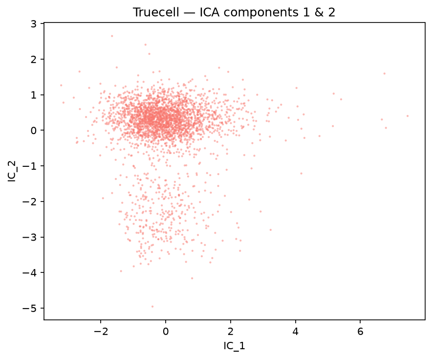
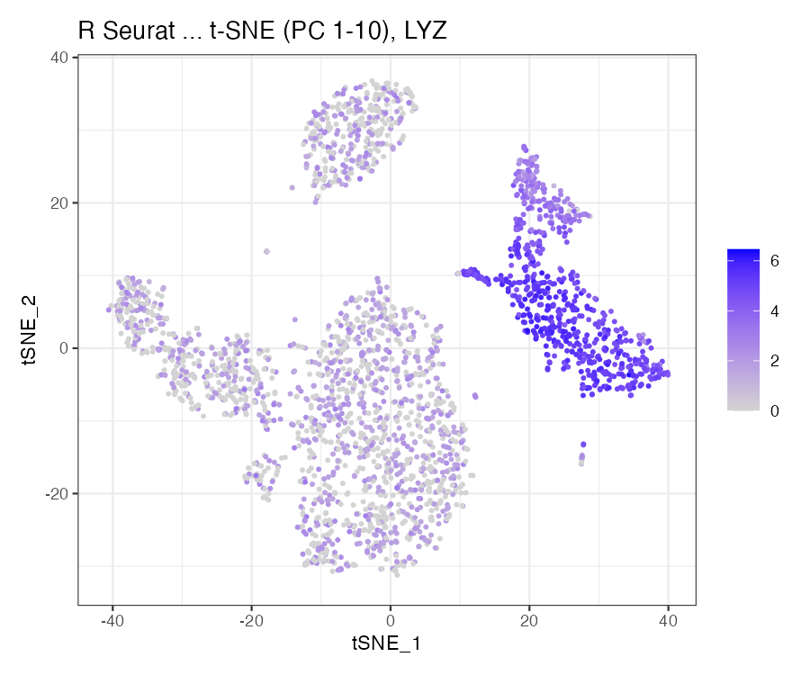

# Dimensional-Reduction Extras — R Seurat vs Truecell (Python)

The three reductions that sit *beside* the standard PCA → UMAP path, and the one
question every guided-clustering run has to answer first: **how many PCs are
real?** Every R Seurat call is paired with the Truecell equivalent and both outputs
are shown side by side.

> **Dataset:** PBMC 3k — 2,700 peripheral blood mononuclear cells, 10x Genomics
> (2016), the same section used in [Tutorial 1](pbmc3k_tutorial.md).
> Auto-downloads (~8 MB).
> **R reference:** Seurat 5.5.1 · **Python:** Truecell

| Seurat | Truecell |
|---|---|
| `JackStraw(obj, dims = 20)` | `jack_straw(obj, dims=20)` |
| `ScoreJackStraw(obj, dims = 1:20)` | `score_jackstraw(obj, dims=20)` |
| `RunICA(obj, nics = 20)` | `run_ica(obj, nics=20)` |
| `RunTSNE(obj, dims = 1:10)` | `run_tsne(obj, dims=range(10))` |

> **This tutorial found and fixed two defects.** `jack_straw` built its
> permutation null the wrong way, and `score_jackstraw` aggregated it with the
> wrong statistic. Together they made truecell keep **all 20** PCs where Seurat
> keeps 13 — the function could not do the one thing it exists for. Both are
> fixed in the same pull request; the [findings](#what-this-tutorial-found) are
> written up below with before-and-after numbers.

---

## Headline

| Metric | Result | Band |
|---|---|---|
| **PCs kept** (run before the drop-off) | **truecell 14 · R 13** | \|Δ\| ≤ **2** |
| PCs significant at α = 0.05 | truecell 1-14 · R 1-13 + 15, 19 (Jaccard **0.81**) | ≥ **0.75** |
| PCA bases matched one-to-one and in order | through PC **20** of 20, min \|r\| **1.0000** | ≥ PC 13 |
| ICA, matched \|Pearson r\| over 20 components | **0.9991** (worst pair 0.9960) | — |
| t-SNE, 30-NN retained from PCA | truecell **0.474** · R **0.476** | — |
| t-SNE, 30-NN shared between the two tools | 0.844 | — |

The **Band** column is the point of this revision: those three numbers are
allowed to move, so `--report` now checks each against a declared range and
exits non-zero outside it. Every band is derived from measurement — a 60-seed
sweep for the cutoff — and carries its reason in
`BANDS` in `pbmc3k_dimreduc_tutorial.py`.

---

## Setup

<table>
<tr><th>R (Seurat)</th><th>Python (Truecell)</th></tr>
<tr>
<td>

```r
library(Seurat)

pbmc <- CreateSeuratObject(
  Read10X(data.dir), min.cells = 3, min.features = 200)
pbmc <- NormalizeData(pbmc)
VariableFeatures(pbmc) <- hvg      # shared with Python
pbmc <- ScaleData(pbmc, features = hvg)
pbmc <- RunPCA(pbmc, features = hvg, npcs = 50)
```

</td>
<td>

```python
from truecell.datasets import pbmc3k
from truecell.truecell import create_truecell_object
from truecell.preprocessing import (
    normalize_data, find_variable_features, scale_data)
from truecell.reduction import run_pca

counts, genes, cells = pbmc3k()
obj = create_truecell_object(
    counts=counts, assay="RNA", min_cells=3, min_features=200,
    feature_names=genes, cell_names=cells)
normalize_data(obj)
find_variable_features(obj, nfeatures=2000)
hvg = list(obj.assays["RNA"].variable_features)
scale_data(obj, features=hvg)
run_pca(obj, n_pcs=50, features=hvg)
```

</td>
</tr>
</table>

### The shared basis, and why it comes first

JackStraw's null is built from the scaled matrix and the PCA basis, so if the two
tools disagree about which cells or genes are in play, nothing downstream is
interpretable. The Python run writes the exact barcodes and HVGs it used to
`figures_dimreduc/cells.txt` and `hvg_features.txt`; the R script reads them back
and subsets to them. (Seurat's assay constructors rewrite underscores in feature
names — pbmc3k's `Y_RNA` becomes `Y-RNA` — and truecell's factories now apply the
same rule; both sides still normalise through it before matching, so a handoff
written before the change lines up too.)

Step 0 of the comparison then checks the bases actually agree:

```
Per-PC |correlation| over 20 PCs: median 1.0000
Matched one-to-one and in the same order through PC 20 (min |r| there: 1.0000).
```

All 20 PCs match one-to-one, to 1 − 3e-15 at worst: **the comparison is decisive
across the whole range**, so any JackStraw difference below belongs to JackStraw.

This is the number that moved most since the tutorial was written, and it moved
because of a check that did not exist then. It used to read `median 0.9759,
matched through PC 15`, with the noise tail permuting past that point. The cause
was not PCA: the R reference had been generated from an older
`hvg_features.txt`, and `find_variable_features` had since reshuffled **6 of the
2,000** HVGs across the selection boundary — all twelve genes involved rank
between 1916 and 2016, where the standardized variances differ in the third
decimal. Six genes in, six genes out, and the whole tail of the basis
comparison degraded. `check_same_features` now refuses to compare against a
reference built on a different feature set, so this cannot be read as a PCA
divergence again.

The bands below rest on that: `pca_basis_aligned_through` is declared as a
**precondition** (≥ 13, R's own cutoff) rather than as a result. A per-PC
JackStraw comparison past the point where the two tools number components
differently is not comparing like with like.

---

## JackStraw — how many PCs are significant?

<table>
<tr><th>R (Seurat)</th><th>Python (Truecell)</th></tr>
<tr>
<td>

```r
pbmc <- JackStraw(pbmc, dims = 20, num.replicate = 100)
pbmc <- ScoreJackStraw(pbmc, dims = 1:20)

score <- JS(pbmc[["pca"]], slot = "overall")[, "Score"]
which(score <= 0.05)
#>  [1]  1  2  3  4  5  6  7  8  9 10 11 12 13 15 19
```

</td>
<td>

```python
from truecell.jackstraw import jack_straw, score_jackstraw
# significant_dims is this tutorial's helper, not a truecell export
from tutorials.pbmc3k_dimreduc_tutorial import significant_dims

js = jack_straw(obj, dims=20, num_replicate=100)
scores = score_jackstraw(obj, dims=20)

significant_dims(scores, alpha=0.05)
#> array([ 1,  2,  3,  4,  5,  6,  7,  8,  9, 10, 11, 12, 13, 14])
```

</td>
</tr>
</table>

| PC | truecell score | R score | truecell features ≤ 1e-5 | R features ≤ 1e-5 |
|---:|---:|---:|---:|---:|
| 1 | 2.0e-157 | 5.1e-155 | 608 | 600 |
| 5 | 2.7e-106 | 3.1e-111 | 430 | 448 |
| 9 | 1.5e-06 | 4.2e-06 | 25 | 23 |
| 13 | 5.0e-04 | 2.9e-04 | 14 | 15 |
| **14** | **0.041** | **0.133** | 6 | 4 |
| 16 | 1.000 | 1.000 | 1 | 1 |
| 20 | 1.000 | 1.000 | 1 | 1 |

Both tools fall off the same cliff after PC 13. At the tutorial's own seed (42)
truecell's PC 14 lands at 0.041 — just inside alpha — so it keeps **14** where R
keeps 13. That single-PC gap is the seed scatter measured below, and it is now
asserted rather than described.

<table>
<tr><th>R (Seurat)</th><th>Python (Truecell)</th></tr>
<tr>
<td></td>
<td></td>
</tr>
</table>

The `features ≤ 1e-5` column is the like-for-like one: it is computed the same
way from either tool's per-feature p-value matrix, so it separates a difference
in the *null* (these counts move) from a difference in the *aggregation* (only
the scores move). That distinction is what located both defects.


### The residual is permutation scatter

R's `JackRandom` seeds each replicate from its loop index, so `JackStraw` in R is
**deterministic** — verified here: `set.seed(1)` and `set.seed(999)` give
byte-identical scores. Truecell seeds from its `seed` argument instead, so its
answer moves a little from run to run:

A five-seed table used to stand here, and it was the wrong instrument: it
recorded five draws as if they were the answer, and the numbers in it have since
drifted. Sweeping 60 seeds against the same R reference gives the distribution
instead:

| PCs kept | 12 | 13 | 14 | 15 |
|---|---|---|---|---|
| seeds (of 60) | 2 | **28** | 11 | 19 |

R's deterministic **13 is also truecell's modal answer**, and the worst case is two
PCs either side. That is what `BANDS["jackstraw_keep_gap"]` asserts — `|truecell −
R| ≤ 2` — and `--report` exits non-zero if it is exceeded. A prose sentence
saying "R sits at the bottom of truecell's spread" could not have failed, so a
regression landing on 15 would have read exactly like a good run landing on 15.

The PCs where the significance *calls* differ are all after the drop-off. R's own
significant set on the current reference is 1–13 plus stray 15 and 19, which is
why the Jaccard band (`≥ 0.75`, measured 0.8125 worst and 0.8750 median) sits
lower than the cutoff band is tight: that number moves with R's noise tail as
well as truecell's, and the cutoff is the thing an analyst acts on.

---

## What this tutorial found

Both defects were caught by comparing against R, not by the test suite — which
was green through both, on synthetic fixtures. That is the third and fourth
defects this initiative has surfaced, after the two RPCA bugs.

### 1. The permutation null was too tight

R's `JackRandom` permutes the selected rows and then **re-runs a full PCA** on the
modified matrix, taking the null loadings from that refit basis. Truecell projected
the permuted rows onto the **fixed** original embedding — much cheaper, but a
fixed basis cannot rotate to absorb the scrambled signal, so the permuted
loadings come out too small. Against a null that tight, ordinary noise features
look extreme.

| features ≤ 1e-5, PCs 14-20 (pure noise) | |
|---|---|
| truecell, before | 167, 203, 112, 109, 182, 155, 120 |
| truecell, after | 4, 3, 1, 3, 7, 1, 2 |
| **R Seurat** | **3, 5, 0, 1, 4, 5, 4** |

### 2. The aggregation was the wrong test

`ScoreJackStraw` in R runs `prop.test` on the count of features below
`score.thresh` against the count expected under a uniform null,
`floor(n × thresh)`. Truecell ran a one-sided KS test against Uniform(0, 1) —
a far more sensitive statistic on thousands of features. Its **largest** score
across all 20 PCs was `8.1e-112`, so nothing ever failed the threshold:

| | truecell, before | truecell, after | R Seurat |
|---|---|---|---|
| PC 1 (real signal) | 0 | 2.0e-157 | 5.1e-155 |
| PC 16 (pure noise) | 1.1e-168 | **1.000** | **1.000** |
| PCs called significant | **20 of 20** | 14 | 13 |

R's `prop.test` is ported exactly rather than approximated — `ScoreJackStraw`'s
output *is* that p-value — and reproduces R to nine significant figures across
the full range (1e-143 to 1.0).

A third, smaller gap closed alongside them: `JackStrawData.fake_reduction_scores`
was declared but never populated, where R stores the null.

---

## ICA — the same components, differently named

Independent components are defined only up to sign and order, so a column-wise
comparison is meaningless: component 3 in R may be component 11, negated, in
Python. The components are matched one-to-one by \|Pearson r\| with the Hungarian
algorithm, which asks the question that *is* well posed.

<table>
<tr><th>R (Seurat)</th><th>Python (Truecell)</th></tr>
<tr>
<td>

```r
pbmc <- RunICA(pbmc, features = hvg, nics = 20)
ica <- Embeddings(pbmc, "ica")
```

</td>
<td>

```python
from truecell.reduction import run_ica

run_ica(obj, nics=20)
ica = obj.reductions["ica"].cell_embeddings
```

</td>
</tr>
</table>

**Mean matched \|r\| = 0.9991**, worst matched pair 0.9960 — the two runs find the
same subspace.

<table>
<tr><th>R (Seurat)</th><th>Python (Truecell)</th></tr>
<tr>
<td></td>
<td></td>
</tr>
</table>

---

## t-SNE — structure, not coordinates

R's `Rtsne` is Barnes-Hut; truecell calls scikit-learn. The coordinates are not
comparable across implementations and never will be, so the comparison is on
neighbourhood structure: what fraction of each cell's 30 nearest neighbours the
embedding preserves from the PCA space it was built from. That number is each
tool judged against its own input, so the two are directly comparable.

<table>
<tr><th>R (Seurat)</th><th>Python (Truecell)</th></tr>
<tr>
<td>

```r
pbmc <- RunTSNE(pbmc, dims = 1:10)
```

</td>
<td>

```python
from truecell.reduction import run_tsne

run_tsne(obj, dims=range(10), reduction="pca")
```

</td>
</tr>
</table>

| | truecell | R Seurat |
|---|---|---|
| 30-NN retained from PCA | **0.474** | **0.476** |
| 30-NN shared between the tools | 0.844 | |

Both panels are coloured by *LYZ* rather than by cluster — cluster labels are
arbitrary integers that would not correspond between tools, whereas this gene's
value on this cell is the same number on both sides.

<table>
<tr><th>R (Seurat)</th><th>Python (Truecell)</th></tr>
<tr>
<td></td>
<td></td>
</tr>
</table>

---

## Reproducing this

```bash
python tutorials/pbmc3k_dimreduc_tutorial.py   # downloads ~8 MB, writes the shared lists
Rscript tutorials/pbmc3k_dimreduc_verify.R     # slow: 100 PCA refits, ~2 min
python tutorials/generate_dimreduc_plots.py    # figures + the side-by-side numbers
```

`JackStraw` is genuinely expensive on both sides — it re-runs a full PCA per
replicate, 100 times by default. Lower `num_replicate` when iterating, but note
it also sets the p-value resolution: the smallest non-zero empirical p is
`1 / (num_replicate × n_permuted)`.

---

## Notes

- **The elbow plot is still the cheap first look.** `figures_dimreduc/py_03_elbow.png`
  and `r_02_elbow.png` show it; JackStraw is what you reach for when the elbow is
  ambiguous, which on pbmc3k it somewhat is.
- **`prop_freq` has a floor.** R falls back to 3 features when
  `nrow × prop.use < 3`; truecell matches that, and also truncates rather than
  rounds up, as R's `sample(size = nrow * prop.use)` does.
- **`jack_straw` needs stored feature loadings** — it uses them as the observed
  statistic, exactly as R takes `Loadings(object[[reduction]], projected = FALSE)`.
  It raises rather than silently falling back if they are absent.
