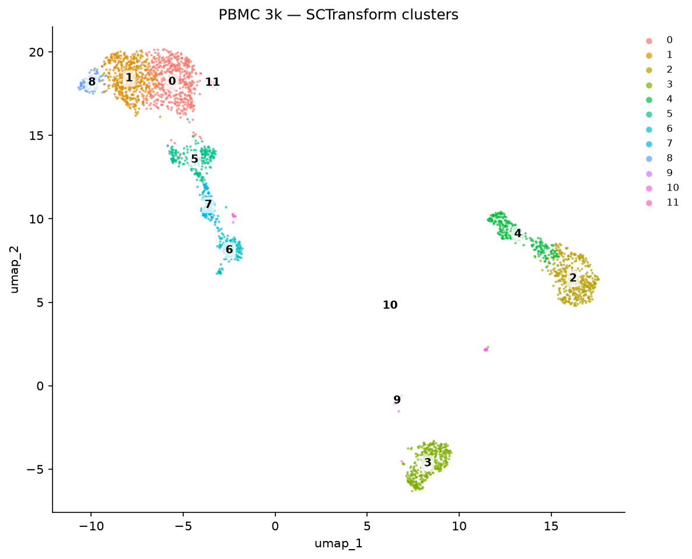
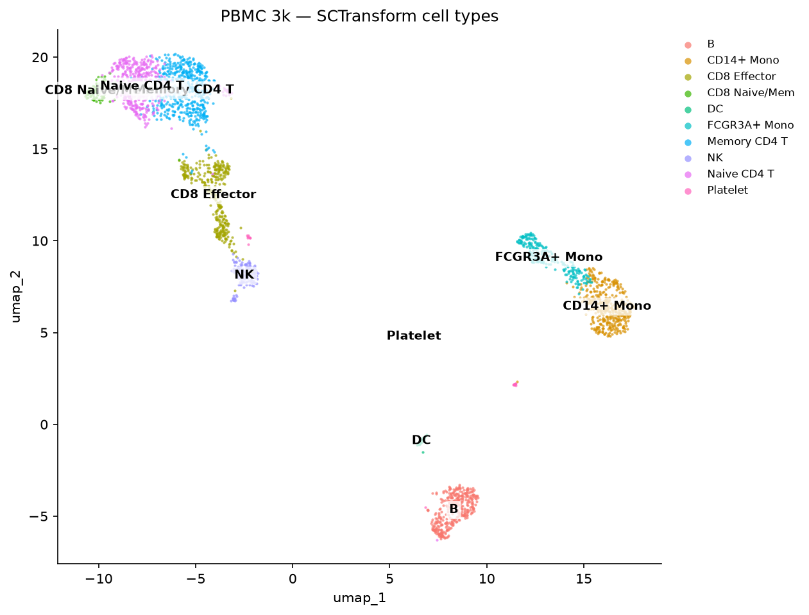
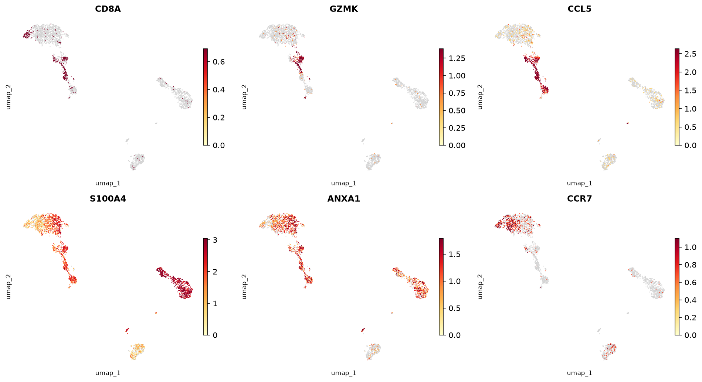
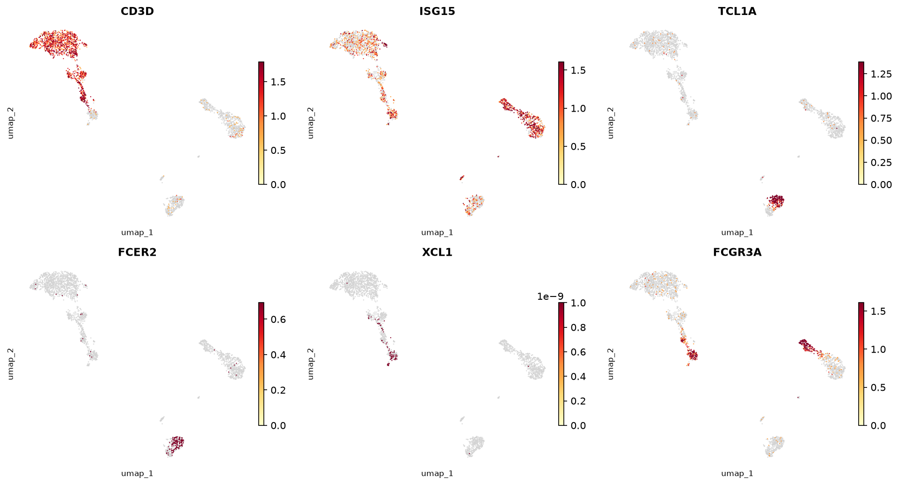
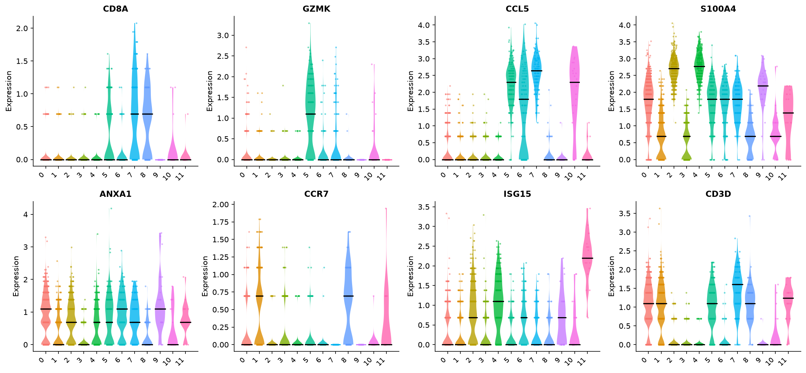
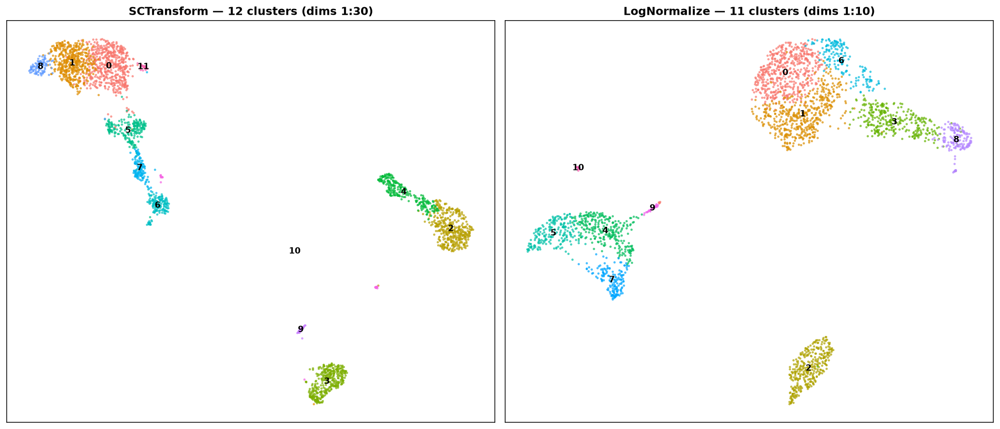

# SCTransform Tutorial — R Seurat vs Truecell (Python)

A Python port of Seurat's
[sctransform vignette](https://satijalab.org/seurat/articles/sctransform_vignette)
on the **PBMC 3k** dataset. `SCTransform` replaces the
`NormalizeData → FindVariableFeatures → ScaleData` trio with a single
**regularized negative-binomial model**: counts are modelled per gene as a
function of cell sequencing depth, the per-gene parameters are smoothed across
genes, and the model's **Pearson residuals** become the normalized values. The
vignette's point is that this removes technical effects more effectively, so —
run over more PCs (dims 1:30) — it resolves finer immune subsets.

> **Dataset:** 3k PBMCs — 10x Genomics (2016)
> **Python:** Truecell v0.9.0

```bash
python tutorials/pbmc3k_sctransform_tutorial.py   # printed validation + the model handoff
python tutorials/generate_sctransform_plots.py    # writes figures_sctransform/  (Truecell)
Rscript tutorials/pbmc3k_sctransform_verify.R     # R figures + r_sct_model.csv / r_anchors.json
python tutorials/pbmc3k_sctransform_tutorial.py --report   # the side-by-side, gene by gene
```

Most R figures below link the canonical
[Seurat vignette](https://satijalab.org/seurat/articles/sctransform_vignette)
images; the two the vignette omits (cell-type UMAP, SCT-vs-standard) are
generated locally by `pbmc3k_sctransform_verify.R`.

---

## Step 1 · Load data & QC metric

<table>
<tr><th>R (Seurat)</th><th>Python (Truecell)</th></tr>
<tr><td>

```r
library(Seurat)
pbmc_data <- Read10X("pbmc3k/filtered_gene_bc_matrices/hg19/")
pbmc <- CreateSeuratObject(counts = pbmc_data)
pbmc <- PercentageFeatureSet(pbmc, pattern = "^MT-",
                             col.name = "percent.mt")
```

</td><td>

```python
from truecell.datasets import pbmc3k
from truecell.truecell import create_truecell_object
from truecell.preprocessing import percentage_feature_set

counts, genes, cells = pbmc3k()
pbmc = create_truecell_object(counts=counts, assay="RNA", min_cells=3,
                            min_features=200, feature_names=genes,
                            cell_names=cells, project="pbmc3k")
percentage_feature_set(pbmc, pattern=r"^MT-", col_name="percent.mt")
```

</td></tr>
</table>

---

## Step 2 · SCTransform (one call replaces three)

`SCTransform` regresses `percent.mt` out of the residuals and returns **3,000**
variable features in a new **`SCT`** assay.

<table>
<tr><th>R (Seurat)</th><th>Python (Truecell)</th></tr>
<tr><td>

```r
pbmc <- SCTransform(pbmc, vars.to.regress = "percent.mt",
                    verbose = FALSE)
# -> 3000 variable features, assay "SCT"
```

</td><td>

```python
from truecell.sctransform import sctransform

sctransform(pbmc, vars_to_regress=["percent.mt"], n_features=3000)
# -> obj.assays["SCT"] with counts / data / scale.data layers
#    3000 variable features; SCT is now the active assay
```

</td></tr>
</table>

> Truecell's `sctransform` follows R's algorithm step for step, in pure NumPy: a
> vectorised per-gene GLM, `theta.ml` for the NB dispersion, and regularization
> of the parameters across genes by Nadaraya–Watson smoothing against the log10
> **geometric** mean, with a Sheather–Jones bandwidth. Like Seurat 5 it defaults
> to `vst.flavor="v2"` (`vst_flavor="v2"`) — depth slope fixed at `log(10)`,
> non-overdispersed genes modelled as pure Poisson, and a variance floor — with
> `vst_flavor="v1"` available for the original 2019 model. `scale.data` holds the
> clipped Pearson residuals for the 3,000 variable features (a genuine
> feature-subset layer).

---

## Step 3 · PCA → UMAP → clustering over 30 PCs

<table>
<tr><th>R (Seurat)</th><th>Python (Truecell)</th></tr>
<tr><td>

```r
pbmc <- RunPCA(pbmc, verbose = FALSE)
pbmc <- RunUMAP(pbmc, dims = 1:30)
pbmc <- FindNeighbors(pbmc, dims = 1:30)
pbmc <- FindClusters(pbmc)            # resolution 0.8
DimPlot(pbmc, label = TRUE)
```

</td><td>

```python
from truecell.reduction import run_pca
from truecell.neighbors import find_neighbors
from truecell.clustering import find_clusters
from truecell.umap import run_umap

run_pca(pbmc, n_pcs=50, features=pbmc.assays["SCT"].variable_features)
find_neighbors(pbmc, dims=range(30), k_param=20)
find_clusters(pbmc, resolution=0.8, random_seed=0)
run_umap(pbmc, dims=range(30), seed=42)
```

</td></tr>
<tr>
<td></td>
<td></td>
</tr>
</table>

The T-cell mass resolves as a **cytotoxicity gradient** — Naive CD4 → Memory
CD4 → CD8 Effector → NK — alongside two monocyte types, B cells, DC/pDC, and
platelets. Annotating by relative marker enrichment gives:

<table>
<tr><th>R (Seurat)</th><th>Python (Truecell)</th></tr>
<tr>
<td></td>
<td></td>
</tr>
</table>

> The published Seurat vignette stops at clusters and prints no
> cell-type-annotated plot, so the R panel is generated by
> [`pbmc3k_sctransform_verify.R`](pbmc3k_sctransform_verify.R): the same SCT
> workflow, annotated by the same relative marker-enrichment rule Truecell uses.
> Both resolve the fine T subsets SCTransform is meant to sharpen.

---

## Step 4 · Marker feature plots (the vignette panels)

<table>
<tr><th>R (Seurat)</th><th>Python (Truecell)</th></tr>
<tr><td>

```r
FeaturePlot(pbmc, features = c("CD8A","GZMK","CCL5",
                               "S100A4","ANXA1","CCR7"), ncol = 3)
FeaturePlot(pbmc, features = c("CD3D","ISG15","TCL1A",
                               "FCER2","XCL1","FCGR3A"), ncol = 3)
```

</td><td>

```python
from truecell.plotting import feature_plot

feature_plot(pbmc, ["CD8A","GZMK","CCL5","S100A4","ANXA1","CCR7"],
             reduction="umap", assay="SCT", ncol=3,
             min_cutoff="q05", max_cutoff="q95")
feature_plot(pbmc, ["CD3D","ISG15","TCL1A","FCER2","XCL1","FCGR3A"],
             reduction="umap", assay="SCT", ncol=3,
             min_cutoff="q05", max_cutoff="q95")
```

</td></tr>
<tr>
<td></td>
<td></td>
</tr>
<tr>
<td></td>
<td></td>
</tr>
</table>

`CD8A`/`GZMK`/`CCL5` mark the CD8 effector tip; `CCR7` marks the naive end;
`S100A4`/`ANXA1` mark memory T cells; `FCGR3A` marks the CD16⁺ monocytes and NK;
`TCL1A`/`FCER2` pick out B-cell sub-structure — matching the vignette.

---

## Step 5 · Violin plots

<table>
<tr><th>R (Seurat)</th><th>Python (Truecell)</th></tr>
<tr><td>

```r
VlnPlot(pbmc, features = c("CD8A","GZMK","CCL5","S100A4",
        "ANXA1","CCR7","ISG15","CD3D"), pt.size = 0.2, ncol = 4)
```

</td><td>

```python
from truecell.plotting import vln_plot
vln_plot(pbmc, ["CD8A","GZMK","CCL5","S100A4","ANXA1","CCR7","ISG15","CD3D"],
         group_by="sct_clusters", assay="SCT", ncol=4, pt_size=2.0)
# pt_size overlays jittered cells, matching R's VlnPlot(pt.size = 0.2);
# matplotlib sizes points by area, so the numeric value differs.
```

</td></tr>
<tr>
<td></td>
<td></td>
</tr>
</table>

> Both panels plot the SCT `data` layer (`log1p` of corrected counts) — R's
> `VlnPlot` default for an SCT assay — with cells jittered over each violin. The
> distributions track gene-for-gene: `CD8A`/`GZMK` spike on the cytotoxic CD8
> cluster, `CCL5` across the CD8/NK end, `CD3D` over all T clusters, `CCR7` low
> and naive-restricted. Both resolve **12 clusters (0–11)**, numbered by size, but
> the two runs build slightly different graphs, so compare the per-gene shapes
> rather than column positions. (See the accuracy note below.)

---

## Step 6 · SCTransform vs standard log-normalization

The published Seurat vignette does not include this comparison figure, but both
toolkits can produce it — running SCTransform (dims 1:30) and LogNormalize
(dims 1:10) on the same cells and rendering them side by side for a direct view
of the resolution difference:

<table>
<tr><th>R (Seurat)</th><th>Python (Truecell)</th></tr>
<tr>
<td></td>
<td></td>
</tr>
</table>

> Each panel: left = SCTransform (dims 1:30), right = LogNormalize (dims 1:10).
> The R panels come from [`pbmc3k_sctransform_verify.R`](pbmc3k_sctransform_verify.R).

---

## Accuracy vs the R vignette

| Aspect | R Seurat (vignette) | Truecell | Match |
|--------|---------------------|--------|:-----:|
| Normalization model | NB Pearson residuals | NB Pearson residuals | ✅ |
| Variable features | **3,000** | **3,000** | ✅ |
| PCs used | 30 (dims 1:30) | 30 (dims 1:30) | ✅ |
| `vars.to.regress` | `percent.mt` | `percent.mt` | ✅ |
| Major populations | T, NK, B, 2× Mono, DC, platelet | all recovered | ✅ |
| CD8 effector split (CCL5/GZMK) from CD4 | yes | yes | ✅ |
| Naive vs memory CD4 (CCR7 vs S100A4) | yes | yes | ✅ |
| `vst.flavor` default | v2 | v2 | ✅ |
| Resolves more than log-norm | yes (the vignette's claim) | yes — 12 vs 11 | ✅ |
| Clusters at resolution 0.8 | **12** (live run; vignette prints none) | **12** | ✅ |
| Clusters, LogNormalize arm | **11** | **11** | ✅ |
| Variable features shared with R | 3,000 | 2,913 (97.1%) | ✅ |
| Regularized theta vs R (Spearman) | — | **1.0000** over the 8,724 finite thetas | ✅ |
| Genes v2 calls non-overdispersed | 3,848 | 3,848 — the *same* genes (Jaccard 1.0000) | ✅ |
| Regularized intercept vs R (Spearman) | — | 1.0000 | ✅ |
| Residual variance vs R (Spearman) | — | 0.9986 (Pearson 0.9996) | ✅ |
| `detection_rate` · `gmean` vs R | — | max abs diff 5.0e-16 · 1.2e-12 | ✅ |
| Residual clips (`sqrt(N)` · `sqrt(N/30)`) | ±51.9615 · ±9.4868 | identical | ✅ |

**These numbers are reproduced, not recorded.** Everything in the table above
comes out of a comparison you can re-run:

```bash
python tutorials/pbmc3k_sctransform_tutorial.py      # writes py_sct_model.csv + py_anchors.json
Rscript tutorials/pbmc3k_sctransform_verify.R        # writes r_sct_model.csv  + r_anchors.json
python tutorials/pbmc3k_sctransform_tutorial.py --report
```

The R script dumps Seurat's own `SCTModel.list[[1]]@feature.attributes` — the
fitted model, per gene — and truecell stores the same eight columns under the same
names on the SCT assay's `meta_data`, so the two tables line up directly. That
matters more here than anywhere else in the series: this model was once wrong in
four separate ways at once and the tutorial still drew a perfectly plausible
UMAP. A picture cannot fail; a Spearman of −0.89 can.

**Where it matches.** The model, the 3,000 variable features, the 30-PC
embedding, and the **biology** all reproduce: the CD8-effector / CD4 / NK split
and the marker patterns the vignette highlights are all recovered. Against a live
Seurat 5.5.1 / sctransform 0.4.3 run on the same cells, `detection_rate` and
`gmean` agree to machine precision, the regularized intercept and theta both rank
identically (Spearman 1.0000), the 3,848 genes v2 declares non-overdispersed are
*exactly* the same genes on both sides, and both arms of the workflow now land on
the same cluster counts — **12** under SCTransform, **11** under LogNormalize.

**Where it differs.** Two places, both small and both expected. Residual variance
ranks at Spearman 0.9986 rather than 1, which moves 87 of the 3,000 variable
features (98 of the top 100 still agree); `vst` samples its 2,000 step-1 genes at
random, so R does not reproduce *itself* across seeds here either. And
`residual_mean` is the one column that does not track by rank — Spearman 0.71
against Pearson 0.99. It is also the one column nothing downstream reads: Seurat
records it but selects features on `residual_variance`. The rank disagreement
sits entirely in genes whose residual mean is ~1e-3 or smaller, which is
numerical dust on residuals that range to ±52.

> **The ±1 cluster gap this section used to describe is closed.** It read "13
> against R's 12" for a long time, attributed to the RNG and to the different
> clustering libraries. Both arms now agree exactly. What changed was not
> SCTransform but the graph underneath it — PR #55 stored Seurat's directed kNN
> graph, restored the SNN self-edge and added `GroupSingletons`.

> **This was wrong until recently.** Truecell used to resolve **9** clusters here —
> *fewer* than log-normalization's 11, which inverts the vignette's entire point.
> A moment estimator stood in for `theta.ml`, the regularization smoothed against
> the arithmetic rather than geometric gene mean and targeted `log(theta)` rather
> than the overdispersion factor, and residual variance was computed from
> residuals clipped at `sqrt(N/30)` instead of `sqrt(N)`. The result flattened
> every residual: the regularized theta came out *anti*-correlated with R's
> (Spearman −0.89) and only 414 of 3,000 variable features agreed. See the
> CHANGELOG and `tests/test_sctransform_r_fidelity.py`.

---

## API Translation (SCTransform additions)

| Task | R (Seurat) | Python (Truecell) |
|------|-----------|-----------------|
| SCTransform | `SCTransform(obj, vars.to.regress="percent.mt")` | `sctransform(obj, vars_to_regress=["percent.mt"])` |
| Model flavor | `SCTransform(obj, vst.flavor="v2")` (default) | `sctransform(obj, vst_flavor="v2")` (default) |
| Use SCT assay | `DefaultAssay(obj) <- "SCT"` (automatic) | active assay set to `"SCT"` automatically |
| Variable features | `VariableFeatures(obj)` | `obj.assays["SCT"].variable_features` |
| Residuals | `GetAssayData(obj, "scale.data")` | `obj.assays["SCT"].layers["scale.data"]` |
| Per-gene model fit | `SCTResults(obj, slot="feature.attributes")` | `obj.assays["SCT"].meta_data` (`theta`, `residual_variance`, `gmean`) |

---

## References

> Hafemeister C, Satija R (2019). **Normalization and variance stabilization of
> single-cell RNA-seq data using regularized negative binomial regression.**
> *Genome Biology* 20, 296. https://doi.org/10.1186/s13059-019-1874-1

> Choudhary S, Satija R (2022). **Comparison and evaluation of statistical error
> models for scRNA-seq.** *Genome Biology* 23, 27. (sctransform v2)

> Seurat sctransform vignette:
> https://satijalab.org/seurat/articles/sctransform_vignette
